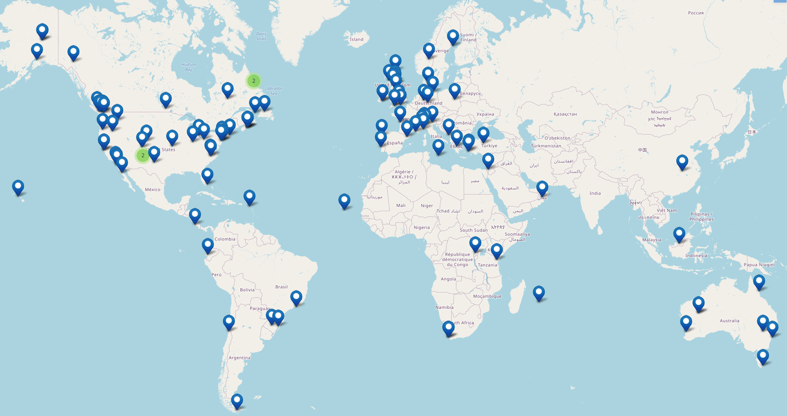

# Introductory workshop, August/September 2022 

Does the following describe your situation?

- Considering the use of distance sampling for population assessment?
- Wish to have individual attention learning to analyse distance sampling data sets?
- Curious about variants of distance sampling that may suit your specific goals?
- Interested in using **R** for your distance sampling analysis? 

If so, consider taking the live online version of our distance sampling training as have participants from these locations around the world.

## Overview
Training in distance sampling design and analysis has been conducted in St Andrews for the past 25 years. In addition, training materials and video lectures were placed online in 2018 and have been visited by >14000 users in the past 3 years.
We now offer these lectures, discussions and exercises in an interactive format, enabling participants to engage in lectures, conduct guided analyses of data sets and ask questions of the instructor.

## Instructor
The workshop instructor is [Eric Rexstad](https://www.creem.st-andrews.ac.uk/person/er26/)

## Timing
We will offer this workshop 29 August through 09 September 2022 between the hours of **1400 and 1630 UK time**.  The first two hours of each session are obligatory, the last half hour is devoted to discussion.  Follow this link to find the [time of day this is offered in your time zone.](https://www.timeanddate.com/worldclock/fixedtime.html?msg=Introductory+distance+sampling+training+workshop&iso=20220829T14&p1=3853&ah=2&am=30)  

## Enrollment limit
The number of participants is limited to 15 to facilitate time for questions and individual assistance with the exercises. 

## Format and delivery method
The training workshop will be delivered via the internet using [Zoom software](https://zoom.us) that enables participants to interact with the instructor during lectures and exercises.

The workshop will be delivered in 10 two-hour sessions. Each session will consist of an interactive lecture, a computing exercise analysing distance sampling data sets and a concluding question and answer session discussing principles and technical details of the session. Sessions will take place weekdays over a two week period.  *Note:* In addition to the daily Zoom session, we expect participants to devote time each day outside these sessions to work on the practical exercises.  Questions arising outside of the Zoom session will be answered either by email or during the following Zoom session.

When participants have registered, further details will be provided regarding:

- scheduling a test Zoom session with the instructor to ensure the internet connection can support video conferencing
- access to the RStudio cloud site for the training workshop
- location of the online lecture materials

## Content

In the first instance, the workshop will be based upon analyses using the Distance package in R. All participants will make use of the [cloud version of R-Studio](https://rstudio.cloud/). Participants will not need to install R software onto their computers. Instead R, the R-Studio programming environment, necessary packages and data sets will all be available when you access the RStudio Cloud site created for the workshop.

## Concepts described
Distance sampling concepts to be discussed include:

- line transects
- point transects
- survey design
- detection function models
- estimation of uncertainty and its sources
- stratification for variance reduction
- indirect (dung or nest) surveys

## Prerequisites
You should have familiarity, if not proficiency, with the R programming language; code will be provided for carrying out the 9 workshop exercises.

## Registration
The registration fee is 225 GBP. All participants are asked to abide by our [workshop code of conduct](code-of-conduct). Registration is *now open* and will close **05 August 2022**.

### Payment
Payment should be made using the online store at the University of St Andrews. Follow the link below to access the online store, register and make payment:
https://onlineshop.st-andrews.ac.uk/conferences-and-events/events/creem/online-live-workshop-introductory-distance-sampling-29th-august-9th-september-2022

## Testimonials
“I really like your teaching style. The pace is steady enough for ample note taking, but quick enough to keep my attention span. The humour gets me chuckling alone at my desk. The concepts are so easy to understand and relate to. Some of these concepts I’ve been aware of for a long time in a kind of ‘working knowledge’ way, but hearing you describe the theory behind them is giving me a lot of ‘oh yeah!’ moments. It is a real pleasure and is giving me a lot to think about for my own teaching.”  — Dr Sarah Marley, <em>University of Portsmouth</em>

***

“I would like to say I really liked RStudio Cloud and it is working just fine and I am really enjoying using it as a student. I'm looking forward to using it as an instructor too. I didn't get the chance to give you a feedback about the first half of the course, so I will do it now. I really liked the first half of the course. I love distance sampling and I am enjoying every second of the course! The only thing I can say about this particular workshop is it deserves more time.” — Kaan Özgencil, PhD student, <em>Department of Biological Sciences, Middle East Technical University, Ankara</em>

***

"I’m really enjoying the course! It has really helped with my understanding of some of the basic concepts. My R education has been very sporadic and with very little guidance, so this has been really good for me. So glad it was offered!" —  Rebecca, <em>United States</em>

## Widening participation scholarship

We are offering one free place on the workshop to encouraging participation by scientists from countries with fewer resources, and from groups traditionally under-represented in wildlife science.  Please see [here](widening-participation) for more information.  Applications for the August/September 2022 workshop will be accepted 27 June - 08 July 2022. 

## Enquiries

For information about workshops please contact Eric Rexstad, email: [er26@st-andrews.ac.uk](mailto:er26@st-andrews.ac.uk)

## Terms and Conditions
[Information about the University of St Andrews Online Payment Services is available here.](https://onlineshop.st-andrews.ac.uk/help/terms-and-conditions)
