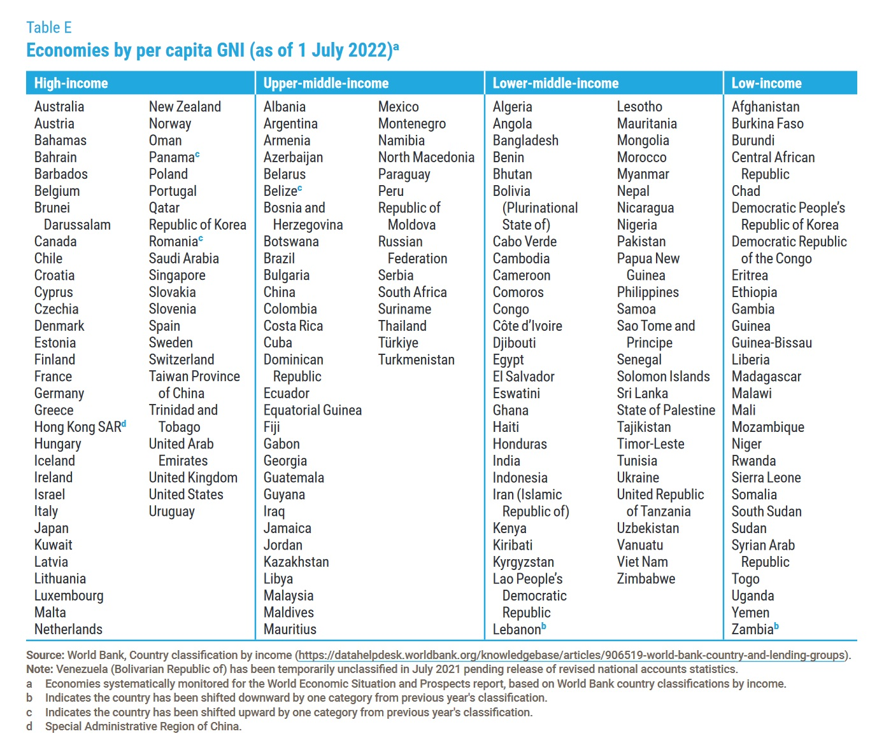

# Distance sampling workshops widening participation scholarship

The Centre for Research into Ecological and Environmental Modelling is committed to encouraging participation in our distance sampling workshops by scientists from countries with fewer resources, and from groups traditionally under-represented in wildlife science.  To this end, we will donate one free place on each workshop, covering the cost of the registration fee.

<!--
## Eligibility

Applicants must be working scientists or students who are nationals of and who operate in a middle- or lower-income country (as defined by the United Nations Dept of Economic and Social Affairs – see below for list).  For online workshops, applicants must have access to internet connection and computing facilities to successfully participate.
-->

## Application procedure

To apply, please email the workshop instructor listed under “Enquiries” on the workshop information page (linked from [here](https://workshops.distancesampling.org/)) with your CV and a short document (maximum one page) outlining your work and how this training will enhance it, and describing your need for a scholarship.  <!-- Please include a statement to confirm that you are a national of and also work in an eligible country (see below for eligibility).-->  For online workshops, please include a statement confirming that you have access to internet connection and computing facilities sufficient for videoconferencing (Skype, Teams, Zoom, etc).  Information you send us will be treated as confidential. 

The closing date for applications is given on the workshop information page linked from [here](https://workshops.distancesampling.org/).

## Award criteria

Applications will be ranked according to: (1) merit, in terms of the likely difference the training will make to the applicant’s career and to wildlife conservation/science; (2) need; (3) whether the applicant is from an under-represented group in wildlife science.  One component of need is country of origin, and in this respect priority will be given to applicants from lower income countries, in the following order (from right to left):

<!--## Eligible countries-->

<!--Participants from all countries except those listed as high-income in the following table are eligible.-->  

The table was obtained from [this UN site](https://unctad.org/system/files/official-document/wesp2023_en.pdf).

